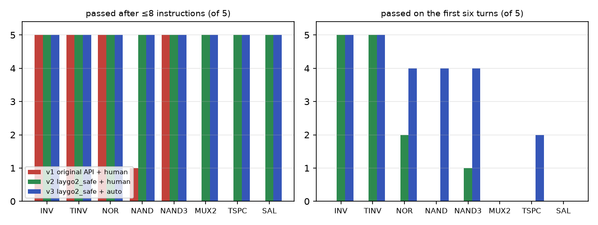
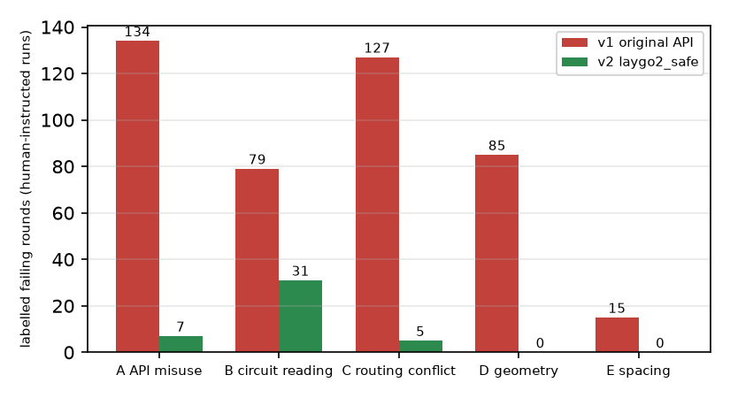
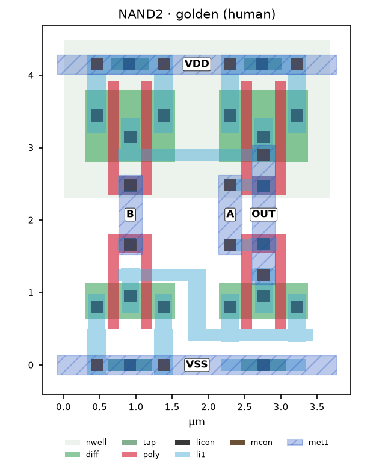
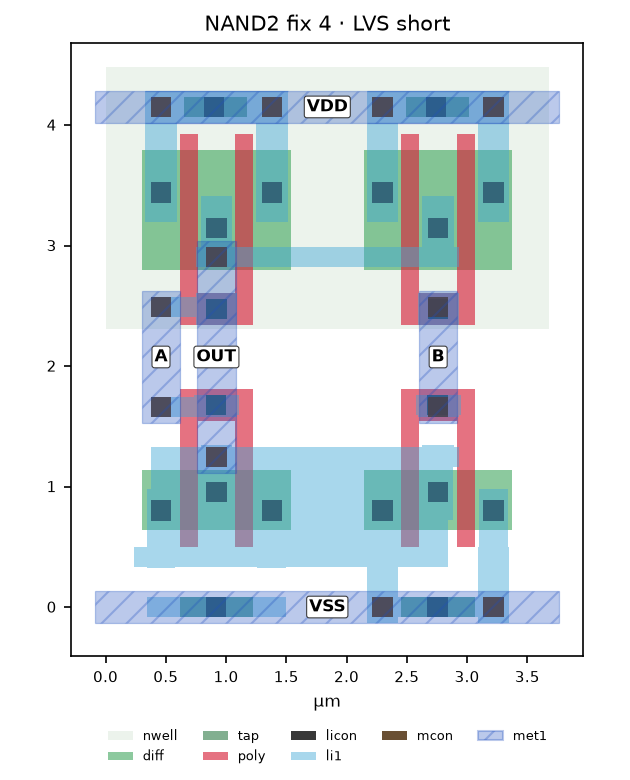
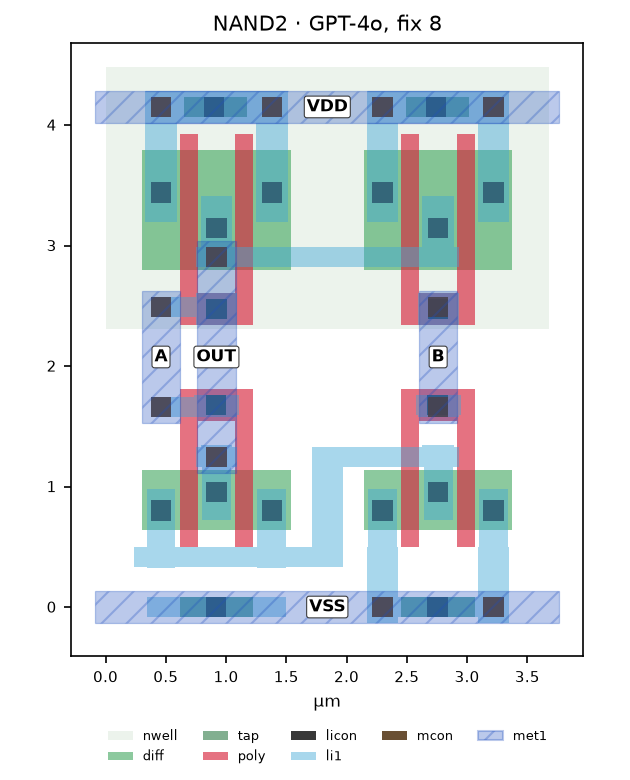
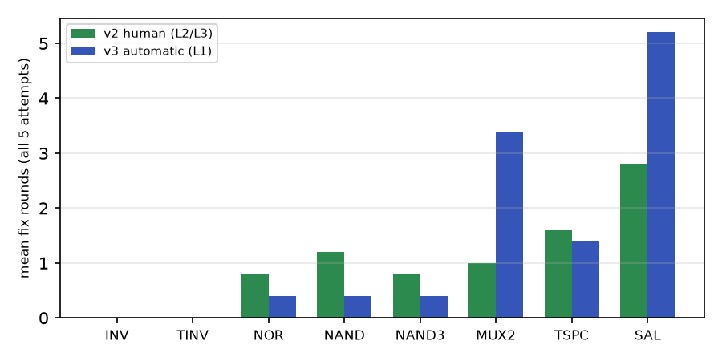
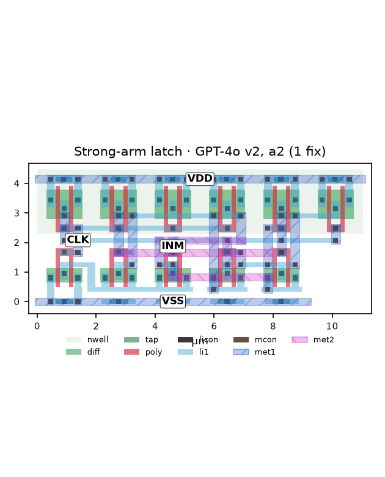
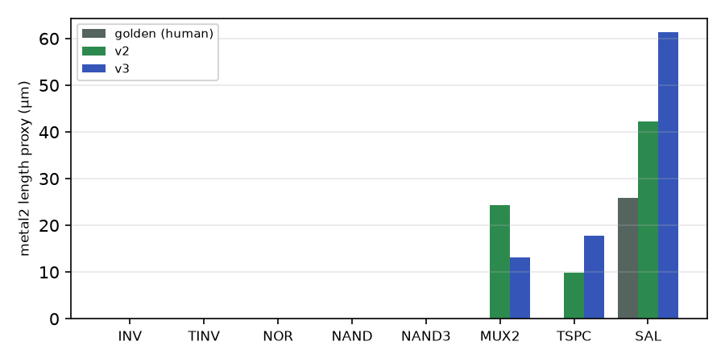

# Where LLM Layout Generation Fails: An Open-Source Reproduction of LLM-Driven Template-and-Grid Layout and an Interface Layer That Makes It Self-Healing

**Author:** Toragonite (GitHub handle; replace with the author's name) · **Date:** 1 October 2026
**Code and data:** https://github.com/Toragonite/laygo2-llm-agent · **Status:** technical report, not peer reviewed

## Abstract

You et al. (MLCAD 2024 WIP, arXiv:2408.07279) proposed letting a large language model (LLM) write Python layout generators for the template-and-grid framework LAYGO2 from natural-language instructions, with the designer inspecting the result and asking for modifications. We reproduce this flow on a fully open-source stack (public laygo2, SkyWater SKY130, Magic, netgen) with a scripted DRC/LVS judge, a fixed protocol for the human's instructions, and a failure taxonomy. On eight transistor-level cells (2–11 transistors, including the paper's 2-to-1 MUX, ratioed TSPC flip-flop and strong-arm latch) with five attempts each, GPT-4o passes 0 of 40 attempts on the six context turns alone and 21 of 40 after up to eight human instructions. Labelling every failing round shows that most failures are not circuit mistakes but friction at the LLM–framework interface: misused return values, wires drawn on occupied tracks, and a routing primitive that silently fills a rectangle between misaligned points. We therefore add a thin, net-aware layer, `laygo2_safe`, that keeps laygo2's architecture and adds validated inputs, an occupancy table, a connect() primitive with track search, and netlist-aware checks that fail at the offending line. With it, the same tasks pass 40 of 40 (13 of 40 on the first turns), with fix rounds dropping from 225 to 41, and interface-type failure labels dropping from 134/127/85 to 7/5/0. Because every remaining failure is now a precise tool message, feeding that message back verbatim replaces the human: 40 of 40 pass with no human in the loop (24 of 40 on the first turns, 56 automatic rounds, ≈ $2.4). Layout area matches the human-written references (ratio 0.98); the automatic router uses more metal2 on the larger cells, which we measure and leave as future work. We state the confounds (model, library and prompt wording changed together) and release all logs, prompts and protocols.

## 1. Introduction

Custom cell layout (logic standard cells, high-speed mixed-signal primitives) is still largely manual. Generator-based frameworks such as BAG and LAYGO/LAYGO2 [1–3] let designers describe a layout as Python code over process-portable templates and abstract grids, which raises productivity but moves the burden to writing that code. You et al. [4] asked whether an LLM can write the generator from natural language, with the designer steering interactively, and reported thirteen DRC/LVS-clean designs, from NAND gates to a 32 Gb/s serializer, using ChatGPT-4.

Their report leaves several questions open for anyone who wants to build on it: the prompt logs are no longer available, the process node and tools are not stated, each design is reported once (no success rate or variance), and the amount of human help is only summarized as a prompt count. This work makes the setting reproducible and measurable, and then uses the measurement to find and fix the bottleneck. Our contributions:

1. An open-source reproduction: public laygo2 (pinned), SKY130, Magic DRC and netgen LVS wrapped in a one-command judge that was first validated with human-written reference layouts, including three verification pitfalls that would otherwise produce false passes or false failures (§3.2).
2. A measurement protocol for interactive LLM layout generation: four specificity levels for the human's instructions, a five-type failure taxonomy applied to every failing round, a cap on instructions, and contamination rules (§3.4). All runs record model, temperature, prompt and tool versions, tokens and labels.
3. A baseline on eight cells × five attempts (§4) and a failure analysis showing that interface friction, not circuit knowledge, dominates (§5).
4. `laygo2_safe`, a thin layer over laygo2 that removes that friction without changing laygo2's architecture (§6), validated by rewriting all eight reference layouts on it.
5. Measurements with the layer under human instructions and under purely automatic feedback (§7), a negative result for one feedback variant, and quality metrics beyond pass/fail (§8).

## 2. Background

**Template-and-grid layout.** In LAYGO2 a *template* is a pre-drawn, DRC-clean block (a transistor with a given number of fingers, a via), and a *grid* maps integer coordinates to physical positions whose pitches absorb the process's width and spacing rules. A generator places template instances on a placement grid and draws wires on routing grids by integer track indices; the same code targets another process by swapping the technology file. The abstraction is attractive for an LLM because coordinates are small integers and most DRC rules are absorbed by templates and grids.

**The paper's flow.** The LLM first converts a SPICE netlist into per-transistor dictionaries (`N0 = {"D": "O", "G": "A", "S": "INT"}`), then, over several turns in which the designer explains placement rules, alignment strategy, routing commands and track-based routing strategy, emits placement and routing code; the designer inspects the layout and issues modification instructions until DRC and LVS pass (Figs. 2–4 of [4]). Reported prompt counts range from 3+3 (NAND) to 9+36 (strong-arm latch). The authors rate interactive placement and routing as good and autonomous optimization as normal (placement) to bad (routing).

## 3. Experimental setup

### 3.1 Stack

| component | version |
|---|---|
| laygo2 (public) | commit `cc6276a` (Jan 2024); the SKY130 workspace at `e7bc4fd`. Later versions are incompatible with the workspace. The public release lacks the `netmap` module used by the paper's authors; the netlist-to-dictionary step is performed by the LLM, so this is not needed. |
| process | SKY130A, open_pdks `6d4d117` |
| DRC / extraction | Magic 8.3.460 (built from source; the Ubuntu package crashes on the SKY130 tech file), rule deck `drc(full)` |
| LVS | netgen 1.5.133 with the SKY130 setup |
| LLM | `gpt-4o-2024-05-13` for the reproduction (closest fixed model to the paper's 2024 ChatGPT-4); `gpt-4o-2024-08-06` for the improvement runs (prompt caching); Chat Completions API, provider-default temperature, 4096 output tokens, nothing stored on the provider side |

### 3.2 Judge and its pitfalls

`flow/check_cell.py` runs a generator from the workspace root, sources the exported Magic script in a fresh Magic process (one process per cell; Magic cannot reset a loaded cell), runs DRC, extracts a SPICE netlist, runs LVS against a reference netlist and prints one JSON line (`gen_ok`, `drc_errors`, `lvs_match`, `area_um2`, stage times and raw error text). Before any LLM was involved, human-written reference generators for all eight cells had to pass it. Three pitfalls were found and are handled in the judge:

- **LVS false passes.** netgen 1.5.133 prints "Circuits match uniquely" when a transistor width is wrong (it adds "Property errors were found" elsewhere) and when two top-level pins are swapped (it only marks `**Mismatch**` in the pin table). `lvs.sh` passes only when all three conditions hold. Negative controls (wrong width, swapped pins, wrong topology) are rejected for every cell.
- **DRC counts.** On the hierarchical cell, `drc listall count` includes violations of vias and template pieces checked in isolation (17 on a clean inverter). DRC is run with the full rule deck on a flattened copy of the top cell.
- **Hierarchical extraction.** Magic 8.3.460 silently drops a sub-cell whose only direct contents are via arrays from hierarchical extraction (the use count is decremented per array element), giving DRC-clean layouts that fail LVS. The gate-level references (latch, D flip-flop) work around it; the eight cells used here are flat.

Reference netlists use the transistor sizes the templates actually draw (nfet_01v8_lvt W = 0.5 µm and pfet_01v8 W = 1.0 µm per finger, L = 0.15 µm, two fingers), not the W = 1.2/2.4 µm of the workspace's example netlists, which the layouts never draw.

### 3.3 Tasks

| cell | transistors | nets | source of the reference layout |
|---|---|---|---|
| INV, NAND2, NOR2, TINV, NAND3, 2-to-1 MUX | 2, 4, 4, 4, 6, 10 | 4–12 | workspace examples, patched (single size, paths, no private modules) |
| ratioed TSPC flip-flop, strong-arm latch | 7, 11 | 8, 10 | written from Fig. 9(d)/(e) of [4]; two fingers per device; connectivity references only, not sized or simulated |

The LLM receives only the cell name and the reference netlist with comments stripped and device names renamed `XM1, XM2, …` in file order, so that no layout hint leaks through instance names. The same file is the LVS reference. Each cell is attempted five times.

### 3.4 Protocol for the interactive loop

The context reconstructs the paper's Figs. 2–4 as six user turns (netlist → dictionaries; placement rules and alignment strategy; placement code; routing commands; pin access and track strategy; routing and the complete script). No example generator is shown. The modification loop is then governed by `docs/protocol.md`:

| rule | value |
|---|---|
| instruction levels | L1 tool output only · L2 diagnosis · L3 what to change and which API/rule · L4 coordinates, column numbers, routing plans. **Baseline allows ≤ L3.** |
| failure types | A API misuse · B circuit-reading error (ties, memberships, omissions) · C routing conflict/short · D geometry misunderstanding · E spacing. Multiple labels per failing round. |
| budget | ≤ 8 instructions per attempt; one instruction = one message |
| contamination | instructors never open the reference generators or layouts; they see the task netlist, the LLM's code and conversation, the judge's outputs and rendered layouts |
| record | model, temperature, git hash of prompts and tools, attempt index, date, instructor, tokens, per-round labels |

Instructions were written by four instances of a coding agent (Claude) acting as the designer, two cells each, under the protocol. This differs from the paper's human designer and introduces instructor variance, which we report.

## 4. Reproduction: baseline results

Figure 1 (left, red) and Table 1 give the baseline. No attempt passed on the six context turns alone: 34 of 40 crashed while running (undefined template variables, misread return values, placement helpers applied to pins) and 6 failed LVS. After up to eight instructions, 21 of 40 passed; all three cells with ten or more transistors and both high-speed circuits failed every attempt. Total tokens 2.69 M in / 0.36 M out, ≈ $19.

**Table 1.** Baseline (v1): original laygo2 API, `gpt-4o-2024-05-13`, human-style instructions ≤ L3, 5 attempts per cell.

| cell | passed | first-turn passes | mean instructions when passed | paper's prompts (placement/routing) |
|---|---|---|---|---|
| INV | 5/5 | 0 | 2.2 | — |
| TINV | 5/5 | 0 | 2.4 | — |
| NOR2 | 5/5 | 0 | 4.6 | 3 / 2 |
| NAND2 | 1/5 | 0 | 7.0 | 3 / 3 |
| NAND3 | 5/5 | 0 | 4.0 | — |
| 2-to-1 MUX | 0/5 | 0 | — | 8 / 15 |
| TSPC FF | 0/5 | 0 | — | 3 / 11 |
| strong-arm latch | 0/5 | 0 | — | 9 / 36 |

The NAND2 vs NOR2 gap (1/5 vs 5/5 on equal-sized cells) is partly instructor variance: the NOR instructor explained template geometry (which pins occupy which columns) when the model stalled, the NAND instructor did not. We keep both as they are.

## 5. Failure analysis

Every failing round carries one or more labels (Figure 2, red). Three interface-type labels dominate: A (134), C (127) and D (85); B (79) and E (15) follow. The recurring mechanisms were:

- **A.** `route()` returns a wire or a list depending on the number of objects; `route_via_track()` returns a list whose last element is the track wire; placement-grid helpers were applied to pins; coordinates taken on one grid were used on another; a two-dimensional placement list with rows of unequal length raises a numpy error (6 of 10 first rounds on the larger cells, and the model regressed to it after fixing it).
- **C.** The gate and drain pins of a two-finger template share a column, so the output wire on the drain column shorts the input on the gate column (every inverter attempt); tracks chosen as "pin ± 1" land on a neighbour's tied source; a horizontal track on the source row crosses tied sources.
- **D.** `route()` between two points that differ in both row and column fills the whole rectangle between them, shorting everything underneath (Figure 3).
- **B.** `tie='S'` applied to every transistor regardless of its own dictionary; multi-pin nets built as one nfet drain plus one pfet drain; a transistor dropped from the list when re-ordering.

**Figure 3.** NAND2: (a) human reference; (b) the baseline model after four instructions, DRC-clean but shorted by one `route()` call between points on different rows, which fills a rectangle across the nfet row; (c) the model's passing NAND2 after eight instructions, a mirror image of the reference.

| (a) reference | (b) after 4 instructions: rectangle short | (c) passing, after 8 instructions |
|---|---|---|
|  |  |  |

The labels say where to intervene: A, C and D are properties of the tool surface the LLM has to program against, not of its circuit knowledge, and B is largely a translation slip from a correct dictionary to code. The netlist-to-dictionary turn was correct in all 40 attempts.

## 6. `laygo2_safe`: a thin, net-aware layer

We kept laygo2's architecture (templates, grids, design database, exporters) and the pinned submodule untouched, and added a layer in the repository that an LLM programs against.

| baseline failure | layer behaviour |
|---|---|
| return-value shapes, grid mixing, pins vs instances | every function returns one kind of object; `pt(inst, pin, grid)` returns a point that remembers its grid and is refused on another grid; inputs are validated with messages that say what to do instead |
| rectangle fill between misaligned points | `wire()` refuses two points not on one track; paths are drawn by `connect()` |
| shorts and spacing | the cell keeps an *occupancy table* of every pin, wire and via as physical rectangles per layer tagged with a net; pin footprints were measured on the reference layouts (drain strip 0.24 µm, source bar ±0.225 µm past the contacts, gate strap 0.4 µm, tied-source straps, via pads ±0.13 µm); any new geometry that touches another net or is closer than the layer's rule (li1 0.17 µm, metal1 0.14 µm) is rejected |
| finding a free track | `connect(net, pins, grid)` tries a straight wire, then shared tracks between the pins, then L- and Z-shaped paths, then tracks outside, then an escape on metal2 (grid r34 shares r23's columns); both ends of spanning pins (source, rail) are tried; a connection with no legal li1 path falls back to metal1 |
| errors discovered only at LVS | the cell is given the reference netlist: `nmos(..., ref='XM1')` refuses a wrong tie or finger count at that line, `connect()` refuses a pin whose netlist net differs, `check()` lists unconnected pins, wrong nets, missing ports and nets left in separate pieces |
| ragged placement lists, unplaced devices | `place_rows(nfets, pfets)` accepts rows of different length and refuses a created-but-unplaced device |
| rails, port labels | `rails()` draws both rails; `port()` avoids Magic's label collision when two pin boxes share a centre (one label is otherwise silently lost) |

Validation is twofold: 23 guardrail self-tests, and all eight reference cells rewritten on the layer using only `connect()` (no coordinates, no track indices) pass DRC 0 / LVS match; the MUX becomes 16 % smaller than the human reference because no spacer cells are needed. The six context turns were rewritten for the new API with the same structure and no example code; the tie rule was reworded to "decide per device from its own dictionary".

## 7. Results with the layer

### 7.1 Human-style instructions (v2)

Same eight cells, five attempts, `gpt-4o-2024-08-06`, instructions ≤ L3 by four coding-agent instructors. Thirteen of 40 attempts passed on the six turns alone (INV and TINV 5/5), and **40 of 40** passed after instructions, with 41 fix rounds in total (v1: 225). Labels fell to A 7, B 31, C 5, D 0, E 0 (Figure 2, green). Nineteen of the 22 instructions were L2 (relaying the tool's message with a one-line explanation); none was L4. The remaining B failures had three forms: a tie set contrary to the device's own dictionary (6 of 10 first rounds on the high-speed cells), multi-pin nets built as a single drain pair (parallel devices and fan-out gates omitted), and one pfet dropped from the placement list when re-ordering. Each was repaired by a single instruction quoting the library's message. Tokens 0.76 M in (0.58 M cached) / 0.08 M out, ≈ $2.

A first formal run was discarded: a library bug drew a rail given as a single pin as a zero-length stub and failed DRC on INV; the library was fixed and all 40 attempts were re-run from scratch so that the tool version is uniform.

### 7.2 Automatic feedback only (v3)

Because every failure is now a precise message, we replaced the human with `selfheal.py`: the feedback is the tool output only (the last traceback line or `SafeError`, the script's `CHECK:` lines, DRC rule names with boxes, netgen's net/device counts and pin mismatches, the extracted netlist) followed by a fixed sentence asking for the corrected script; at most eight rounds. The library had meanwhile received the four defects found by the v2 instructors (port label layer, unplaced-device message, split-net check, `rails()`), so v3 is not the same tool version as v2.

**Table 2.** Three conditions, 8 cells × 5 attempts.

| condition | API | repair | passed | first-turn passes | fix rounds | tokens in / cached / out | cost |
|---|---|---|---|---|---|---|---|
| v1 | laygo2 | human ≤ L3 | 21/40 | 0/40 | 225 | 2.69 M / 0 / 0.36 M | ≈ $19 |
| v2 | laygo2_safe | human ≤ L3 | 40/40 | 13/40 | 41 | 0.76 M / 0.58 M / 0.08 M | ≈ $2 |
| v3 | laygo2_safe (+fixes) | automatic, L1 | 40/40 | 24/40 | 56 | 0.95 M / 0.75 M / 0.10 M | ≈ $2.4 |

Small cells now pass on the first turns (NAND2, NAND3, NOR2 four of five). The larger cells need two to three times more automatic rounds than human rounds (MUX 3.4 vs 1.0, strong-arm latch 5.2 vs 2.8) but all pass within the budget, at zero human time.

**A negative result.** The automatic loop sometimes oscillates between a crash and an LVS mismatch. We tried a feedback variant that appends the history of problems (open / fixed / back again). On paired copies of the ten MUX and strong-arm first-round states, rounds went from 43 to 42 and one attempt failed; the variant is not used.

## 8. Quality beyond pass/fail

For the 117 passing layouts (8 references, 21 v1, 40 v2, 40 v3) we measured the cell bounding box, the union area of li1, metal1 and metal2 (converted to a length proxy by the minimum width) and contact counts on the flattened layout. Area equals the reference or is smaller (mean ratio 0.98; MUX 16 % smaller). li1 + metal1 length is within ±5 % for the small cells. On the larger cells the automatic router uses more metal2 than the human designer (strong-arm latch 26 µm reference, 42 µm v2, 61 µm v3; Figure 6): when the local-interconnect search fails it escapes upward, where a designer would have found a lower-layer route. This is the measurable gap between a correct layout and a good one, and the comparison point for the next iteration.

## 9. Threats to validity

- **Confounded changes.** Between v1 and v2 the model (05-13 → 08-06, for prompt caching), the library and the prompt wording changed together; between v2 and v3 the library and prompts changed as well as the repair mechanism. The clearest evidence for the library effect is qualitative: during development, the same LLM code went from fail to pass after a library fix alone (NOR, TSPC, strong-arm latch). A control run (same library, human instructions) would separate the feedback effect.
- **Instructor.** Instructions came from coding-agent instances, not an expert designer; help differed between instructors (NAND vs NOR in v1). A pilot run that used L4 instructions was excluded from the baseline.
- **Comparison with the paper.** The paper does not state how prompts were counted, the process, success rates or manual edits (it mentions manual adjustments for the level shifter). Our prompt totals (six context turns plus instructions) are not directly comparable.
- **Scope.** Eight transistor-level cells with at most eleven transistors, two fingers per device; the high-speed cells are connectivity references only. Gate-level cells (latch, D flip-flop) have reference layouts but were not benchmarked. Each condition has five attempts per cell.
- **Tooling.** The judge, the layer and the loops were implemented with a coding agent; all design decisions are logged with reasons in `docs/paper_notes.md`.

## 10. Related work

Generator-based layout frameworks (BAG [1], LAYGO [2], LAYGO2 [3]) provide the programmable substrate; rule- and template-based analog layout automation (e.g. ALSYN, ALIGN) targets the same cells by other means. LLMs for chip design have mostly produced HDL; You et al. [4] were among the first to generate layout generator code interactively. Our contribution is orthogonal to the model: a measurement protocol and an interface layer that turn the model's failures into messages a loop can act on.

## 11. Conclusion

Reproduced on an open-source stack, the paper's interactive LLM layout flow passes 21 of 40 attempts on eight small cells, and none without human help. Labelling every failure shows that the bottleneck is the interface between the LLM and the framework, not circuit knowledge. A thin net-aware layer that validates inputs, tracks occupancy and finds free tracks removes that bottleneck: 40 of 40 with human help, and 40 of 40 with no human when the layer's messages are fed back verbatim. The remaining gaps are quality (more metal2 than a designer would use) and scale (larger and gate-level cells), both now measurable.

## References

1. E. Chang et al., "BAG2: A process-portable framework for generator-based AMS circuit design," CICC 2018.
2. J. Han et al., "LAYGO: A template-and-grid-based layout generation engine for advanced CMOS technologies," IEEE TCAS-I, 2021.
3. T. Shin et al., "LAYGO2: A custom layout generation engine based on dynamic templates and grids for advanced CMOS technologies," IEEE TCAD, 2023.
4. G. You, Y. Byun, S. Lim, J. Han, "Interactive and automatic generation of primitive custom circuit layout using LLMs," MLCAD 2024 WIP, arXiv:2408.07279.

## Appendix A. Per-cell numbers

| cell | v1 pass / mean instr. | v2 first-turn / pass / mean instr. | v3 first-turn / pass / mean auto rounds |
|---|---|---|---|
| INV | 5/5 · 2.2 | 5 · 5/5 · 0.0 | 5 · 5/5 · 0.0 |
| TINV | 5/5 · 2.4 | 5 · 5/5 · 0.0 | 5 · 5/5 · 0.0 |
| NOR2 | 5/5 · 4.6 | 2 · 5/5 · 0.8 | 4 · 5/5 · 0.4 |
| NAND2 | 1/5 · 7.0 | 0 · 5/5 · 1.2 | 4 · 5/5 · 0.4 |
| NAND3 | 5/5 · 4.0 | 1 · 5/5 · 0.8 | 4 · 5/5 · 0.4 |
| 2-to-1 MUX | 0/5 | 0 · 5/5 · 1.0 | 0 · 5/5 · 3.4 |
| TSPC FF | 0/5 | 0 · 5/5 · 1.6 | 2 · 5/5 · 1.4 |
| strong-arm latch | 0/5 | 0 · 5/5 · 2.8 | 0 · 5/5 · 5.2 |

## Appendix B. Reproducibility

Pinned submodules, the judge, prompts (`llm/context`, `llm/context_safe`), the protocol, instructor briefs, per-attempt logs (prompts, replies, generated code, DRC/LVS outputs, labels) and the CSV summaries are in the repository. Runs are tagged `20260930` (v1), `v2_20260930` (v2), `v3_selfheal` (v3) and `v3b_selfheal` (feedback variant). Prompts and replies were deleted from the provider's side after the runs and are no longer stored there.
